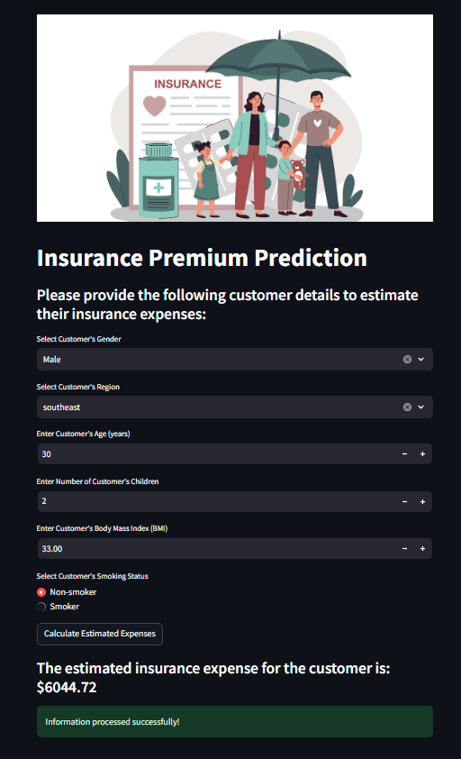

# Insurance Premium Prediction

## Project Goal
The goal of this project is to analyze the relationship between various individual factors — such as age, sex, BMI, number of children, smoking habits, and region of residence — and medical expenses. A predictive model is developed to estimate the annual medical expenditure for new customers based on these factors. This model will assist medical insurance companies in making data-driven decisions when determining premium rates charged to individuals. Additionally, a web application is developed using Streamlit to provide an interactive platform for estimating medical expenses for potential customers.


## Dataset
The dataset used in this project is sourced from Kaggle. It can be downloaded from [here](https://www.kaggle.com/datasets/noordeen/insurance-premium-prediction/data).

## Approach

### Data Exploration
- Utilized **pandas**, **matplotlib**, and **seaborn** to thoroughly investigate the dataset.

### Exploratory Data Analysis (EDA)
- Generated various plots to uncover insights into the relationships between dependent and independent variables/features.

### Feature Engineering
- Scaled numerical features.
- Applied one-hot encoding to categorical features for improved model performance.

### Model Building
- Split the dataset into training and testing sets.
- Trained models using several machine learning algorithms, including:
  - **Linear Regression**
  - **Decision Tree Regressor**
  - **Random Forest Regressor**
  - **Gradient Boosting Regressor**

### Model Selection
- Evaluated all models based on their **Root Mean Square Error (RMSE)** and **R-squared** values to identify the best performer.
- Selected the model with the optimal RMSE and R-squared scores, and created a pickle file using the **pickle** library.

### Web Application Development
- Developed a web application using **Streamlit**, an open-source Python framework designed for data scientists and AI/ML engineers.
- The app collects necessary user inputs and estimates the customer's insurance expenses.

## Web App Interface

Below are screenshots of the web application interface:



### Running the App
To run the web application in your working directory, use the following command:

```bash
streamlit run app.py

